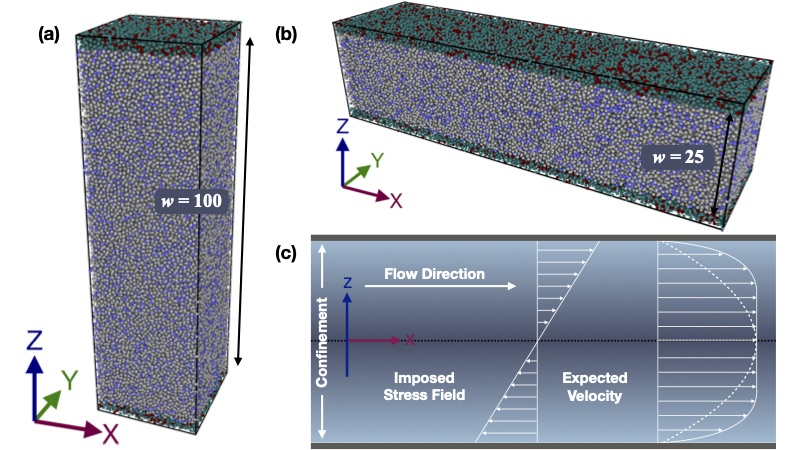
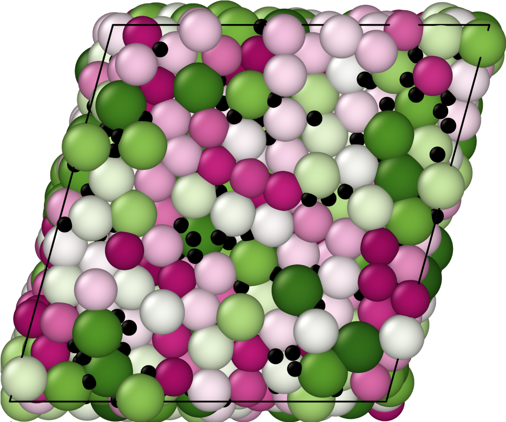

# Research  

During the course of Ph.D. research, I have gained experience in studying the response of glassy systems to thermal and mechanical perturbations, in the form of a temperature gradient and shear respectively. Study of such thermal or mechanical response not only leads to the development of various important applications but also helps in understanding the out-of-equilibrium behaviour of amorphous systems, in general. I have mostly used large scale computer simulations to put a model system under the influence of a thermal gradient or mechanical drive, then to record the spatio-temporal response with microscopic details, soon after applying the perturbation and also after long time in steady state if it can be reached. As a part of different studies, many analytical approaches and their codes have been developed and tested, along with the use of open source softwares.

## Thermal response of glassy system
We have probed the behaviour of a glassy material, applying an external temperature gradient. The detailed understanding of such behaviour is important to describe and develop various natural and manmade systems: magmatic differentiation during pertrogenesis, leakage of trapped nuclear waste in glass, compositional inhomogeneity in the formation of metallic alloys, etc. We have performed extensive molecular dynamics simulations using a model binary glass-forming mixture to understand the response to a thermal gradient, by studying the coupling of heat and mass transport, in supercooled and glassy states. We have also applied a heating-cooling protocol where an appropriate thermal gradient pulse is switched on for a finite duration and then switched off (very similar to laser heating or laser ablation), to show that it is possible to tune the concentration profiles of the glassy states obtained at the end. Such protocol can be used to produce glassy materials having inhomogeneous structure.
### Related article: V. Vaibhav, J. Horbach, and P. Chaudhuri, Phys. Rev. E 101, 022605 (2020).

## Poiseuille flow of soft glass: role of thermalization protocol
A flow through a channel or pipe due a pressure gradient is called Poiseuille flow and this is common to many natural systems and applications like microfluidic devices, 3D printing etc, involving soft glasses exhibiting finite yield stress. Understanding the flow properties of glassy materials, which make a large part of the amorphous family, in such setup can help us to develop various applications. We have performed a numerical study to develop a microscopic understanding of how two different temperature control mechanisms with varying forcing strength affect the Poiseuille flow of a soft glass. The first one is a wall thermostat where we use the confining walls to thermalize the system, leading to a steady non-uniform temperature profile across the channel. In the second method, a thermostat (DPD thermostat) is directly applied to the confining fluid while walls are frozen, resulting no temperature variation across the channel. We compare the steady flow properties of the glassy material in the two thermalization protocols and also with Couette flow under similar conditions. This study will help in developing flow based applications where Poiseuille setup of yield-stress materials can be controlled via appropriate thermal setup.  
### Related article: V. Vaibhav, and P. Chaudhuri, Physics of Fluids 33, 053103 (2021).

## Glassy binary mixture with large size bidispersity: interdiffusion and rheology

In nature or in our daily life, we see a variety of materials where the constituent particles can have a large dispersity in sizes. Most of the studies that have happened to explore various aspects of glassy systems, use a model binary mixture where the size of the particles are comparable. In particular, the rheological properties of mixtures with large size asymmetry have not been much explored. We have considered a model binary mixture with large size bidispersity, known to show large separation in relaxation timescales of the larger and smaller species as the density of the system is increased. We have measured single particle diffusion and the collective interdiffusion, to elucidate that there is finite-size effects in the self-diffusion of the bigger species, which can be removed if the calculation of single particle quantities of larger and smaller species are done in their respective center of mass frames. Further, we have studied the shear response of the same binary mixture with large size ratio, to understand the interplay of intrinsic timescales with the external timescale introduced via shear. We have also explored the onset of rigidity in such mixtures. Further, we measure single particle quantities to understand the behaviour of the system at microscopic level. From these micro and macro measurements, we conclude a density dependent response of the two species in the system. To investigate the role of smaller species in the rheology, we perform simulations varying the composition of the system and conclude that adding smaller particles makes system softer, i.e. reduces the measured viscosity.  

### Related articles: V. Vaibhav, J. Horbach, and P. Chaudhuri, Soft Matter 18, 4427-4436 (2022); V. Vaibhav, J. Horbach, and P. Chaudhuri, J. Chem. Phys. 156, 244501 (2022)

