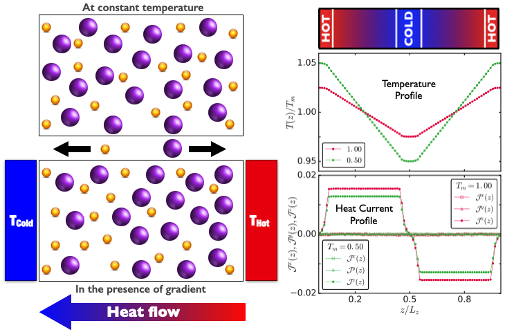

# Reserach  

## Thermal Response of Glass-forming Liquids
How does a glass-forming liquid respond to the externally applied temperature gradient? The answer to this question is relevant in the context of many real-life applications. We present a perspective in this direction via our study. As a response to the thermal gradient, two types of current, thermal current and mass current are setup in the system. Depending on the state of the glassy material, mass current can go to zero in steady state and such state can be characterized by measuring a quantity called Soret-coefficient which is the ratio of the thermal diffusion coefficient and inter-diffusion coefficient. We have measured the behaviour of Soret-coefficient in the supercooled regime. Linear-nonliner response of the system is characterised by constructing a phase diagram. We have also measured the response of the system in the glassy state, where we report the absence of any change in concentration profiles within the observed time window. By applying a heating-cooling protocol, we have shown that it is possible to tune the concentration profiles of the glassy states.

## Poseuille Flow of Glassy Liquids

Poiseuille flow is a pressure induced flow through a confined channel or pipe. The understanding of rheological properties of glasses via Poiseuille flow is important for many applications. In this work, we have studied the impact of two different thermostatting mechanisms to control the temperature of flowing glass by removing the excess heat generated due to the flow. The first one is a wall thermostat where we use the confining walls to thermalize the system. In this case, walls are vibrating and maintained at a fixed temperature. This leads to a steady temperature profile across the channel because of the continuous heat transfer from the center of the channel to the walls. The presence of this temperature gradient results in many non-trivial observations. In the second method, a thermostat DPD thermostat is directly applied to the confining fluid while walls are frozen. In this case, there is no temperature variation across the channel. We compare the steady flow properties of the material in the two thermalization protocols and also with Couette flow under similar conditions. Wall thermostat case shows different branches of flow-curves as the forcing strength is varied. We have also compared the transient behaviour of the flow, where we find that the flow starts early in wall thermostat case compared with DPD thermostat. Different results are also compared with the results from a narrower channel.

## Binary Mixture with Large Size Ratio

In this work, we have studied a binary glassy-forming mixture where the mean diameter ratio between bigger and smaller particles is ~2.86. Bigger particles are polydisperse with mean diameter close to unity while smaller particles are of fixed diameter. Particles in this 50-50 mixture interact via purely repulsive WCA type of interaction. The unperturbed behaviour of this mixture has been studied by Th. Voigtmann and J. Horbach in  [PRL 103, 205901 (2009)], where they show that the large size ratio leads to large separation in relaxation timescales between the two species. Also, as they increase the number density at constant temperature, bigger particles start becoming slow but smaller particles become slow only at very high densities, meaning, two glass transitions in the same system.

To understand the behaviour of the two sub-populations of bigger and smaller species, we measure the interdiffusion in the system. We have observed, at higher densities bigger particles diffusivity goes to zero but interdiffusion is still finite. This means, the center of mass of bigger species is having significant motion because of the fast dynamics of the smaller species. Hence, we propose and calculate different dynamical quantities like mean-squared displacement and self-intermediate scattering function of the two species in the reference frame of their respective center of mass. This presents better picture of the dynamics of the system, particularly of bigger species.

In this work we have studied the shear response of the binary mixture which has been studied in previous section. Since, this mixture has wide timescale separation among the bigger and smaller species, it is very interesting to see the competition of the system timescales with the external timescale introduced via shear. We  impose shear  at different rates to the system and study the response by performing extensive molecular dynamics simulations. The macroscopic response is observed by measuring stress and viscosity as function of shear rate, at different densities. For small densities, there is Newtonian regime  over a large window of shear-rates, which vanishes for higher densities. System shows rigidity evidenced by appearance of dynamic yield stress in small shear-rate regime for higher densities. Also, system shows shear-thinning i.e., decrease in viscosity with increasing shear-rate. Further, we measure single particle quantities like mean-squared displacement and van-Hove correlations to connect macro-picture to microscopic of the system. From these measurements we conclude a density dependent response of the two species in the system. We observe that the major contribution to the viscosity comes from bigger species. So to investigate the role of smaller species, we perform simulations varying the composition of the system and find that adding smaller particles makes system softer.

