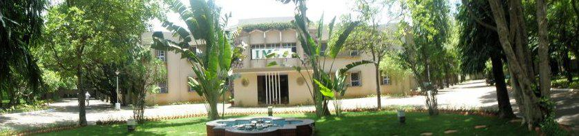

# Welcome !

I am a Post-doctoral researcher at the Institut für Theoretische Physik, Georg-August-Universität Göttingen (Germany), working in the group of <a href="https://www.uni-goettingen.de/en/588919.html">Prof. Peter Sollich</a>, where my primary focus is on investigating the mechanical response of active amorphous solids. Previously, I held a post-doctoral position in the group of Prof. Alessio Zaccone at the University of Milan (Italy), studying the mechanical and vibrational properties of amorphous materials. During my Ph.D. at <a href="https://www.imsc.res.in">The Institute of Mathematical Sciences</a> Chennai (India), I worked with  <a href="https://www.imsc.res.in/pinaki_chaudhuri">Prof. Pinaki Chaudhuri</a> to understand the thermal and mechanical response of glassy systems, mostly using large-scale simulations. In general, I am interested in the broad area of soft matter systems.

# Research Interests: 
* Active amorphous materials
* Vibrational properties of amorphous solids
* Mechanical response of amorphous materials: Yielding, Plasticity, Shear-banding, Modulus
* Inhomogeneity in glassy systems and its mechanical consequences
* Thermal response of glass-forming systems: Thermophoresis, Local heating/cooling, Thermal processing  
* Rheology of complex fluids: Micro-response, Macro-response, Structural changes
* Flow under confinement: Poiseuille flow, Couette flow

<!---

-->

# Education and Employment:  
2025-Present: Post-doctoral researcher, University of Göttingen (Germany)  
2023-2025:    Post-doctoral researcher, University of MIlan (Italy)  
2017-2022:	  PhD in Physics (IMSc Chennai)  
2015-2017:	  MSc in Physics (IMSc Chennai)  
2012-2015:	  BSc (Hons.) in Applied Physics (CUJ Ranchi)

* PhD thesis: Thermo-mechanical Response of Glassy Systems <a href="https://www.imsc.res.in/xmlui/handle/123456789/606">PDF</a>
* MSc thesis: Heat Transport in Glass-Forming Liquids <a href="https://github.com/vinayphys/vinayphys.github.io/blob/master/files/masterThesis_vinayVaibhav.pdf">PDF</a>  
* MSc-cum-Course work details at IMSc <a href="https://github.com/vinayphys/vinayphys.github.io/blob/master/files/imsc_courseDetails.pdf">here</a>   
* Details of my undergraduate course at CUJ <a href="https://github.com/vinayphys/vinayphys.github.io/blob/master/files/cuj_CourseDetails.pdf">here</a>
* My CV <a href="https://drive.google.com/file/d/1gzbXVf6kELm9vIPuFWJBMIIOXTR3Slcg/view?usp=share_link">here</a>

# Connect with me:

[Google Scholar](https://scholar.google.com/citations?user=AicxZvsAAAAJ&hl=hi&oi=ao)|[GitHub](https://github.com/vinayphys)|[ResearchGate](https://www.researchgate.net/profile/Vinay_Vaibhav)|[SpeakerDeck](https://speakerdeck.com/vinayphys)|[Blog]()

Georg-August-Universität Göttingen  
Institut für Theoretische Physik   
Friedrich-Hund-Platz 1, Göttingen 37077, Germany.   
Email: vinayphys [at] gmail.com or vinay.vaibhav [at] uni-goettingen.de

<!---

-->

Copyright @Vinay Vaibhav.   Last updated: April 2025
